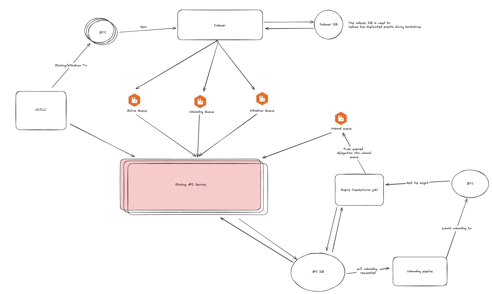

# Staking API Service

The Staking API Service is a critical component of the Babylon Phase-1 system, 
focused on serving information about the state of the network and 
receiving unbonding requests for furt12312her processing. 
The API can be utilised by user facing applications, such as staking dApps. 

## Architectural Design



This architecture is centered around a message-driven approach, 
utilizing RabbitMQ queues for inter-service communication. 
Such a design facilitates high concurrency and enhances fault tolerance by 
allowing for horizontal scaling and leveraging RabbitMQ's message retry features. 
The primary infrastructure components include:

1. MongoDB
2. RabbitMQ
3. Redis cache (Work In Progress)

### Key Features

- **Asynchronous Communication**: Enables decoupled, non-blocking inter-service 
interactions, aside from the unbonding pipeline which follows a different interaction pattern.
- **Fault Tolerance**: Utilizes RabbitMQ's message retry mechanism for resilience 
against transient failures.
- **Horizontal Scalability**: Supports increasing system capacity by 
adding more processing nodes as demand grows.

For more detailed rules applied to message processing, 
refer to the [queue handler documentation](internal/queue/handlers/REAME.md).

### Workflow

#### Standard Staking Path

The standard staking path encompasses user-initiated staking through CLI/UI, 
followed by waiting for the staking period (timelock) to expire.

1. **Transaction Submission**: User-submitted staking transactions are 
confirmed and picked up by the [indexer](https://github.com/babylonchain/staking-indexer) 
after receiving sufficient Bitcoin block confirmations.
2. **Event Queuing**: The indexer sends `ActiveStakingEvent` [messages](https://github.com/babylonchain/staking-queue-client/blob/main/client/schema.go#L24) 
to the Active Event Queue for the staking API service to process.
3. **Processing and State Management**: The staking API service executes statistical calculations, 
data transformation, and staking state management, inserting records into the `timelock_queue` collection.
4. **Timelock Expiry Monitoring**: A dedicated service monitors the `timelock_queue` for 
records with expired Bitcoin Staking timelocks and signals the staking API service 
to update the staking delegation status to `unbonded`. 
This status displays to the user that the staking transaction is ready for withdrawal.

#### Early Unbonding Path

The early unbonding path enables users to on-demand unlock their staked Bitcoin
before the timelock of the staking transaction expires.

1. **Signature Submission**: Via the UI/CLI, users can initiate an early unbonding action,
which involves generating an unbonding transaction and creating a signature for it,
both of which are forwarded to the staking API service.
2. **Signature Verification and Storage**: The staking API service validates the signature
against the unbonding transaction and
stores it for further processing by the unbonding pipeline.
3. **Committee Co-Signing**: The unbonding pipeline collects additional signatures 
from the covenant committee and submits the unbonding transaction to the Bitcoin network.
4. **Transaction Detection**: The unbonding transaction is detected by the staking-indexer 
once it receives a sufficient number of confirmations and a corresponding [unbonding event](https://github.com/babylonchain/staking-queue-client/blob/main/client/schema.go#L70) 
is placed into the RabbitMQ queue.
5. **Processing and State Management**: Similar to the standard path, the staking API service 
handles statistical updates, adjusts the staking state, and inserts a record into the `timelock_queue`.
6. **Finalization**: The expire-service processes items from the `timelock_queue` in 
MongoDB and emits an [expired event](https://github.com/babylonchain/staking-queue-client/blob/main/client/schema.go#L130) 
to RabbitMQ for the staking-api-service to process. This marks completed staking 
transactions as `unbonded`. This status displays to the user that the staking transaction is ready for withdrawal.

## Getting Started

### Prerequisites

- Docker
- Go

### Installation

1. Clone the repository:

```bash
git clone git@github.com:babylonchain/staking-api-service.git
```

2. Run the service:

```
make run-local
```

OR, you can run as a docker container

```
make start-staking-api-service
```

3. Open your browser and navigate to `http://localhost` to see the api server running.


### Tests

The service only contains integration tests so far, run below:

```
make tests
```

### Update Mocks
1. Make sure the interfaces such as the `DBClient`is up to date
2. Install `mockery`: https://vektra.github.io/mockery/latest/
3. Run `make generate-mock-interface`

## Contribution

Feel free to submit a pull request or open an issue.
